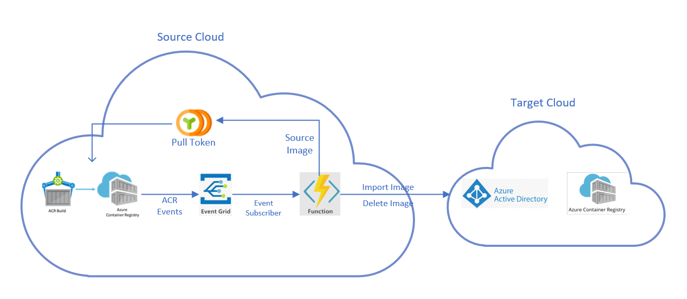

# Multi Cloud Artifact Publish
Azure Container Registry is available in different cloud offerings from Microsoft. It is available in separate Azure clouds for China, US Government etc. In some cases, we would like to setup an Azure container registry in an Azure cloud to be a data replica of another container registry in a different Azure cloud. To achieve it, we will use different Azure services to setup a pipeline that subscribes to the image notifications of a container registry in a source cloud. This pipeline will then publish the artifacts to a container registry in a target cloud using those notifications. The pipeline is illustrated in the below diagram.



The source container registry image events are subscribed using Azure Event Grid to call the function app that triggers import image and delete image actions on the target container registry. The target container registry is authenticated using the service principal created in the registry's Azure AD tenant. The function app authenticates with the source container registry using a token which is scoped to pull permission only. ACR Tasks is used to build and push container images into source container registry that triggers the entire pipeline end to end.

## Getting started

### Prerequisites

### Prepare your environment for Azure CLI
- Use the Bash environment in [Azure Cloud Shell](https://docs.microsoft.com/en-us/azure/cloud-shell/quickstart).
- If you prefer, [install](https://docs.microsoft.com/en-us/cli/azure/install-azure-cli) the Azure CLI to run CLI reference commands.
- The Azure CLI commands in this article are formatted for the **Bash** shell. If you're using a different shell like PowerShell or Command Prompt, you may need to adjust line continuation characters or variable assignment lines accordingly. This article uses variables to minimize the amount of command editing required.
### Azure Account
We will provision different Azure services in two different Azure cloud environments. You may need an Azure account with an active subscription in both public and China Azure clouds. If you don't have an [Azure subscription](https://docs.microsoft.com/en-us/azure/guides/developer/azure-developer-guide#understanding-accounts-subscriptions-and-billing), create a [free account](https://azure.microsoft.com/free/?ref=microsoft.com&utm_source=microsoft.com&utm_medium=docs&utm_campaign=visualstudio) in both clouds before you begin.
### Bash shell
The commands in this tutorial series are formatted for the **Bash** shell. If you prefer to use PowerShell, Command Prompt, or another shell, you may need to adjust the line continuation and environment variable format accordingly.
### Git tools
You will need to clone this repository to publish to Azure Function App. Run ```git --version``` to check that your environment has [Git](https://git-scm.com/book/en/v2/Getting-Started-Installing-Git) installed.
### .Net Core SDK 3.1
The function app is a .Net Core 3.1 application and you will need [.Net Core SDK 3.1](https://www.microsoft.com/net/download) to  build and publish it. Run ```dotnet --list-sdks``` to check that .NET Core SDK version 3.1.x is installed.

## Clone the repository

To deploy the pipeline to replicate artifacts across two different Azure Container registries in different clouds, clone the repository

Clone this repo and enter the directory containing your local clone.
```bash
git clone https://github.com/AzureCR/multi-cloud-publish.git
```
Enter the directory containing the source code:
```bash
cd multi-cloud-publish
```

## Set the environment variables
Open the script [replicate-setup.sh](./replicate-setup.sh]) and modify the different environment variables in the setup section if you wish to use the values that are different from the given default values.

## Execute the script

```bash
./replicate-setup.sh
```
For more detailed explanation of each and every step in the script, see the [setup detailed document](./replicate-setup-detailed.md)


