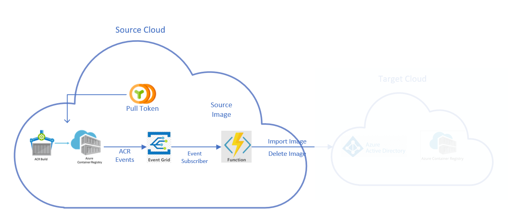

## Multi Cloud Publish In Detail
In this article, we will use Azure CLI to create all the services that make up replication pipeline that is previously described. We will have the source registry in Public Cloud and target registry in China Cloud. The **Source** cloud is Public CLoud and **Target** is China Cloud. Finally, we will push a container image in the source container registry and view the same image in another target registry of a different Azure cloud. Similarly, we delete an image in the source registry and view that the image is deleted in the target registry. The article is structured as a series of steps that are listed below

- [Prerequisites](#prerequisites)

- [Clone the repository](#clone-the-repository)

- [Target Cloud Operations](#target-cloud-operations)

    - [Switch to the Target cloud](#switch-to-the-target-cloud)

    - [Login to the target Cloud](#login-to-the-target-cloud)

    - [Create a resource group in the target cloud](#create-a-resource-group-in-the-target-cloud)

    - [Create a container registry in the target cloud](#create-a-container-registry-in-the-target-cloud)

    - [Create a custom role](#create-a-custom-role)

    - [Create a service principal](#create-a-service-principal)

- [Source Cloud Operations](#source-cloud-operations)

    - [Switch to the Source cloud](#switch-to-the-source-cloud)

    - [Login to the Source Cloud](#login-to-the-source-cloud)

    - [Create a resource group in the source cloud](#create-a-resource-group-in-the-source-cloud)

    - [Create a container registry in the source cloud](#create-a-container-registry-in-the-source-cloud)

    - [Create a pull scoped token](#create-a-pull-scoped-token)

    - [Create an Azure Function app](#create-an-azure-function-app)

    - [Build and Publish the function app project to a Zip file](#build-and-publish-the-function-app-project-to-a-zip-file)

    - [Deploy the function project to Azure Function app](#deploy-the-function-project-to-azure-function-app)

    - [Create a keyvault](#create-a-keyvault)

    - [Assign the access policy](#assign-the-access-policy)

    - [Create secrets for app settings](#create-secrets-for-app-settings)

    - [Set Application Settings for Function App](#set-application-settings-for-function-app)

    - [Subscribe to registry events](#subscribe-to-registry-events)
- Testing

    -[Trigger registry events](#trigger-registry-events)

- Cleanup
    - [Cleanup resources in Target Cloud](#cleanup-resources-in-target-cloud)

    - [Cleanup resources in Source Cloud](#cleanup-resources-in-source-cloud)

- [Things to Know](#things-to-know)


## Prerequisites

### Prepare your environment for Azure CLI
- Use the Bash environment in [Azure Cloud Shell](https://docs.microsoft.com/en-us/azure/cloud-shell/quickstart).
- If you prefer, [install](https://docs.microsoft.com/en-us/cli/azure/install-azure-cli) the Azure CLI to run CLI reference commands.
- The Azure CLI commands in this article are formatted for the **Bash** shell. If you're using a different shell like PowerShell or Command Prompt, you may need to adjust line continuation characters or variable assignment lines accordingly. This article uses variables to minimize the amount of command editing required.
### Azure Account
We will provision different Azure services in two different Azure cloud environments. You may need an Azure account with an active subscription in both public and China Azure clouds. If you don't have an [Azure subscription](https://docs.microsoft.com/en-us/azure/guides/developer/azure-developer-guide#understanding-accounts-subscriptions-and-billing), create a [free account](https://azure.microsoft.com/free/?ref=microsoft.com&utm_source=microsoft.com&utm_medium=docs&utm_campaign=visualstudio) in both clouds before you begin.
### Bash shell
The commands in this tutorial series are formatted for the **Bash** shell. If you prefer to use PowerShell, Command Prompt, or another shell, you may need to adjust the line continuation and environment variable format accordingly.
### Git tools
You will need to clone this repository to publish to Azure Function App. Run ```git --version``` to check that your environment has [Git](https://git-scm.com/book/en/v2/Getting-Started-Installing-Git) installed.
### .Net Core SDK 3.1
The function app is a .Net Core 3.1 application and you will need [.Net Core SDK 3.1](https://www.microsoft.com/net/download) to  build and publish it. Run ```dotnet --list-sdks``` to check that .NET Core SDK version 3.1.x is installed.

## Clone the repository
Clone this repo and enter the directory containing your local clone.
```bash
git clone https://github.com/AzureCR/multi-cloud-publish.git
```
Enter the directory containing the source code:
```bash
cd multi-cloud-publish
```

## Target Cloud Operations


## Switch to the Target cloud

To switch to the target cloud, run the **az cloud set** command. This command takes one required argument, the name of the cloud. You can list available clouds with the **az cloud list** command.

```azurecli
TargetAzureEnvironmentName=AzureChinaCloud

# set the target cloud name
az cloud set --name $TargetAzureEnvironmentName
```

## Login to the target Cloud
Sign in to the Azure CLI by using the ```az login``` command. To finish the authentication process, follow the steps displayed in your terminal. For additional sign-in options, see [Sign in with the Azure CLI.](https://docs.microsoft.com/en-us/cli/azure/authenticate-azure-cli)

## Create a resource group in the target cloud

An Azure resource group is a logical container in which you deploy and manage your Azure resources. The following ```az group create``` command creates a resource group named chinaResourceGroup in the chinanorth2 region. If you want to use a different name for your resource group, set TargetResourceGroupName to a different value.

```azure-cli
TargetResourceGroupName=chinaResourceGroup
TargetRegion=chinanorth2

# create resource group
az group create --name $TargetResourceGroupName --location $TargetRegion
```

## Create a container registry in the target cloud
Next, deploy a container registry into the resource group previously created with the following commands. Before you run the ```az acr create``` command, set TargetACRName to a name for your registry. The name must be unique within Azure, and is restricted to 5-50 alphanumeric characters.

```azurecli
TargetACRName=chinaNorth2Registry

az acr create --resource-group $TargetResourceGroupName --name $TargetACRName --sku Premium --location $TargetRegion
```

## Create a custom role 
We will create [custom role](https://docs.microsoft.com/en-us/azure/container-registry/container-registry-roles#custom-roles) with fine-grained permission on the Azure container registry. This role will define the minimum actions that permit publishing artifacts to the target ACR. It has permissions to import and delete the images of the ACR. The path to the file that has role definition JSON with the required permissions is [replicate-role.json](./replicate-role.json). Please ensure you add your subscription Id to the assignable scope section of the definition in the file at "/subscriptions/<optional, but you can limit the visibility to one or more subscriptions>". 

```azurecli
az role definition create --role-definition @replicate-role.json
```

## Create a service principal
By using an Azure AD [service principal](https://docs.microsoft.com/en-us/azure/container-registry/container-registry-auth-service-principal), we can provide scoped access to a container registry. The below set of commands will create a service principal and will store the service principal's ID and password in environment variables.  These credentials will be used to configure the function app in subsequent steps to authenticate with the target container registry. It will also create a role assignment to this service principal with the custom role that was created in the previous step.

The `ServicePrincipalName` value must be unique within your Azure Active Directory tenant.
If you receive an "'http://acr-publish-artifacts-service-principal' already exists." error, specify a different name for the service principal.

```azurecli
# ServicePrincipalName: Must be unique within your AD tenant
ServicePrincipalName=acr-publish-artifacts-service-principal

# Obtain the full registry ID for subsequent command args
TargetACRResourceId=$(az acr show --name $TargetACRName --query id --output tsv)

# Create the service principal with AcrReplicate role on the registry.
TargetAzureServicePrincipalClientKey=$(az ad sp create-for-rbac --name http://$ServicePrincipalName --scopes $TargetACRResourceId --role AcrReplicate --query password --output tsv)

# Obtain the service principal app ID for subsequent steps
TargetAzureServicePrincipalClientId=$(az ad sp show --id http://$ServicePrincipalName --query appId --output tsv)

# Obtain the service principal tenant ID for subsequent steps
TargetAzureServicePrincipalTenantId=$(az ad sp show --id http://$ServicePrincipalName --query appOwnerTenantId --output tsv)
```

## Source Cloud Operations



## Switch to the Source cloud
To switch to the source cloud, run the **az cloud set** command. This command takes one required argument, the name of the cloud. You can list available clouds with the **az cloud list** command.

```azurecli
SourceAzureEnvironmentName=AzureCloud

az cloud set --name $SourceAzureEnvironmentName
```

## Login to the Source Cloud
Sign in to the Azure CLI by using the ```az login``` command. To finish the authentication process, follow the steps displayed in your terminal. For additional sign-in options, see [Sign in with the Azure CLI.](https://docs.microsoft.com/en-us/cli/azure/authenticate-azure-cli).

## Create a resource group in the source cloud

An Azure resource group is a logical container in which you deploy and manage your Azure resources. The following ```az group create``` command creates a resource group named publicResourceGroup in the westus region. If you want to use a different name for your resource group, set SourceResourceGroupName to a different value.

```azure-cli
SourceResourceGroupName=publicResourceGroup

region=westus

az group create --name $SourceResourceGroupName --location $region
```
## Create a container registry in the source cloud
Next, deploy a container registry into the resource group previously created with the following commands. Before you run the ```az acr create``` command, set SourceACRName to a name for your registry. The name must be unique within Azure, and is restricted to 5-50 alphanumeric characters.

```azurecli
SourceACRName=publicWestUsRegistry

az acr create --resource-group $SourceResourceGroupName --name $SourceACRName --sku Premium --location $region
```
## Create a pull scoped token
We will create a [token](https://docs.microsoft.com/en-us/azure/container-registry/container-registry-repository-scoped-permissions) with a scope map that has pull permissions on all repositories of the source registry. This token will be used by the function app to pull the artifacts from the source registry to execute the import action. If it required to configure repository scoped permissions, you can create token with an associated scope map. 

The following example creates a token `pulltoken` using a reserved scope map that has pull only permissions on all repositories of the registry. The output shows details about the token. By default, two passwords are generated that don't expire, but you can optionally set an expiration date. It's recommended to save the passwords in a safe place to use later for authentication. The passwords can't be retrieved again, but new ones can be generated. We will store these passwords in the environment variables that we use to configure the function app in the subsequent steps.

```azurecli
SourceACRPullTokenName=pulltoken

# create a token and fetch the token password.
SourceACRPullTokenPassword=$(az acr token create --name $SourceACRPullTokenName --registry $SourceACRName --scope-map _repositories_pull --query credentials.passwords[0].value -o tsv)
```
## Create an Azure Function app
Create an Azure function app using ```az functionapp create``` command. The function app is created to run in dotnet runtime of version 3.* under the  [Azure Functions Consumption Plan](https://docs.microsoft.com/en-us/azure/azure-functions/consumption-plan), which is free for the amount of usage you incur here. The command also provisions an associated [Azure Application Insights](https://docs.microsoft.com/en-us/azure/azure-monitor/app/azure-functions-supported-features#:~:text=Supported%20features%20%20%20%20Azure%20Functions%20,%20%20Yes%20%2015%20more%20rows%20) instance in the same resource group, with which you can monitor your function app and view logs. The function app create requires a storage account which is created using ```az storage account create```

The function app will be created with [system assigned identity](https://docs.microsoft.com/en-us/azure/active-directory/managed-identities-azure-resources/overview). This identity will be used to access the keyvault that will contain the app's configuration secrets. The function app's identity is stored in environment variables that will be used to set keyvault access policies in the subsequent steps.

```azurecli
# create a storage account
storageName=replicatefunctionstorage

az storage account create --name $storageName --location $region --resource-group $SourceResourceGroupName --sku Standard_LRS

# create a function app
functionAppName=replicateFunction

FunctionAppObjectId=$(az functionapp create -n $functionAppName --storage-account $storageName --consumption-plan-location $region --runtime dotnet -g $SourceResourceGroupName --functions-version 3 --assign-identity [system] --query identity.principalId -o tsv)
```
## Build and Publish the function app project to a Zip file
We will deploy the function app project files to Azure from a [.zip(compressed)](https://docs.microsoft.com/en-us/azure/azure-functions/deployment-zip-push) file. To generate the .zip file, we will first build the app and publish the artifacts to a folder. We will then compress the folder to a `.zip` file.

```bash
dotnet publish -c Release -o publishFolder

cd publishFolder/

zip -r ../acr-replicate-app.zip ./*
```

## Deploy the function project to Azure Function app
The below command will deploy the function app project to Azure Function app.

```azurecli
az functionapp deployment source config-zip -g $SourceResourceGroupName  -n $functionAppName --src acr-replicate-app.zip
```

## Create a keyvault

We will use [Azure keyvault](https://docs.microsoft.com/en-us/azure/key-vault/general/overview) to store the secrets of the function app settings. The keyvault provides a secure store for the configuration secrets.

```azurecli
ConfigKeyVaultName=replicateAppConfigVault

az keyvault create --name $ConfigKeyVaultName -g $SourceResourceGroupName --location $region
```

## Assign the access policy
A Key Vault [access policy](https://docs.microsoft.com/en-us/azure/key-vault/general/assign-access-policy-cli) determines whether a given security principal, namely a user, application or user group, can perform different operations on Key Vault secrets, keys, and certificates. We will create an access policy for the function app system identity to be able to retrieve the app secrets from this keyvault. We will use `az keyvault set-policy` command to assign the desired permissions.

```azurecli
az keyvault set-policy -n $ConfigKeyVaultName -g $SourceResourceGroupName --object-id $FunctionAppObjectId --secret-permissions get list
```
## Create secrets for app settings
For all the application settings of the function app that are secrets, we will use `az keyvault secret set` command to create secret objects in keyvault. 

```azurecli
az keyvault secret set -n TargetAzureServicePrincipalClientKey --vault-name$ConfigKeyVaultName --value $TargetAzureServicePrincipalClientKey

az keyvault secret set -n SourceACRPullTokenPassword --vault-name $ConfigKeyVaultName --value $SourceACRPullTokenPassword
```

## Set Application Settings for Function App
We will set all the application settings for the function app that we deployed. The settings that are secrets will be referenced from the [keyvault](https://docs.microsoft.com/en-us/azure/app-service/app-service-key-vault-references?toc=/azure/azure-functions/toc.json) and other settings will be set as opaque strings. 

```azurecli
# Obtain the keyvault URI to create Keyvault references
ConfigKeyVaultUri=$(az keyvault show -n $ConfigKeyVaultName -g $SourceResourceGroupName --query properties.vaultUri -o tsv)

az functionapp config appsettings set -n $functionAppName -g $SourceResourceGroupName --settings "TargetAzureEnvironmentName=$TargetAzureEnvironmentName" "TargetAzureServicePrincipalClientId=$TargetAzureServicePrincipalClientId" "TargetAzureServicePrincipalClientKey=@Microsoft.KeyVault(SecretUri=${ConfigKeyVaultUri%?}/secrets/TargetAzureServicePrincipalClientKey/)" "TargetAzureServicePrincipalTenantId=$TargetAzureServicePrincipalTenantId" "TargetACRResourceId=$TargetACRResourceId" "SourceACRPullTokenName=$SourceACRPullTokenName" "SourceACRPullTokenPassword=@Microsoft.KeyVault(SecretUri=${ConfigKeyVaultUri%?}/secrets/SourceACRPullTokenPassword/)"
```

## Subscribe to registry events
Azure Event Grid is a fully managed event routing service that provides uniform event consumption using a publish-subscribe model. In Event Grid, you subscribe to a topic to tell it which events you want to track, and where to send them. We will use [event grid](https://docs.microsoft.com/en-us/azure/container-registry/container-registry-event-grid-quickstart?toc=/azure/event-grid/toc.json) to subscribe to the source registry's events and specify the Azure function app as the endpoint to which it should send events.

```azurecli
# Obtain the source registry Id to set as the source for event grid
SourceACRResourceId=$(az acr show --name $SourceACRName --query id --outputtsv)

# Obtain the resource Id of the function app to set as the endpoint for the event grid.
FunctionAppResourceId=$(az functionapp show --name $functionAppName --queryid -g $SourceResourceGroupName --output tsv)

# Create an event grid subscription.
az eventgrid event-subscription create --name replicateAppSub --source-resource-id $SourceACRResourceId --endpoint $FunctionAppResourceId/functions/Function1 --endpoint-type azurefunction
```

## Testing

## Trigger registry events
Now that the entire pipeline is setup and is up and running, we will generate some events in the source registry. We will use ACR Tasks to build and push a container image to the source registry. ACR Tasks is a feature of Azure Container Registry that allows you to build container images in the cloud, without needing the Docker Engine installed on your local machine. 

### Build and Push image
Execute the following Azure CLI command to build a container image from the contents of a GitHub repository. By default, ACR Tasks automatically pushes a successfully built image to your registry, which generates the `ImagePushed` event. This event should invoke the function app which will then import the image to the target registry

```azurecli
az acr build --registry $SourceACRName --image myimage:v1 -f Dockerfile https://github.com/Azure-Samples/acr-build-helloworld-node.git#main
```

To verify that the built image is in the target registry, execute the following command to view the tags in the "myimage" repository.
**Please note that the target registry is in a different cloud and hence you might need to switch the cloud and login before running this command.**

```azurecli
az acr repository show-tags --name $TargetACRName --repository myimage
```
### Delete the image
Now, generate an `ImageDeleted` event by deleting the image with the `az acr repository delete` command:
```azurecli
az acr repository delete --name $SourceACRName --image myimage:v1
```

To verify that the image is deleted in the target registry, execute the following command to view the tags in the "myimage" repository.
**Please note that the target registry is in a different cloud and hence you might need to switch the cloud and login before running this command.**

```azurecli
az acr repository show-tags --name $TargetACRName --repository myimage
```
You should see a 404 response with no tags in it.

## Cleanup resources in Target Cloud
Once you're done with the resources you created in this article, you can delete them all with the following Azure CLI command. When you delete a resource group, all of the resources it contains are permanently deleted.
```azurecli
az cloud set --name AzureChinaCloud

az group delete --name $TargetResourceGroupName
```

## Cleanup resources in Source Cloud
Once you're done with the resources you created in this article, you can delete them all with the following Azure CLI command. When you delete a resource group, all of the resources it contains are permanently deleted.

```azurecli
az cloud set --name AzureCloud

az group delete --name $SourceResourceGroupName
```

## Things to Know
- The `ImageDeleted` event is generated only when an image is deleted. UnTag of an image doesn't generate any events from ACR. Retagging of the same image with different tags does generate `ImagePushed` and gets replicated to the target registry.
- The function app is created with Consumption hosting plan. The functionality, scaling, and pricing of your functions depend on the type of plan. Please refer to different types of [hosting options](https://docs.microsoft.com/en-us/azure/azure-functions/functions-scale) offered by function app to suit your business needs
- In this article, the function app is created with default retry aand error handling. For enhanced and structured error handling please refer to the [Azure Functions error handling and retries](https://docs.microsoft.com/en-us/azure/azure-functions/functions-bindings-error-pages?tabs=csharp)
- The Azure function app is created with the built in integration with Azure Application Insights to monitor the function. Please refer to the [documentation](https://docs.microsoft.com/en-us/azure/azure-functions/functions-monitoring) to get an overview of how to monitor the azure function.
- The function app is deployed using the zip file created from the local app project. Azure functions has the full range of continuous deployment options to deploy the code continuously by using various integrations. Please refer to [Continuous deployment for Azure Functions](https://docs.microsoft.com/en-us/azure/azure-functions/functions-continuous-deployment) for the respective documentation
- This article assumes that the source and target registry endpoints are accessible to public netowrk. It is not intenteded to work if any of the registries are restricted using private endpoints or network isolation rules like firewalls etc.


The output of this command show properties of the created keyvault. We will obtain the `Vault URI` from these properties to configure the keyvault references for the funtion app settings. 
```azurecli
az keyvault set-policy -n $ConfigKeyVaultName -g $SourceResourceGroupName --object-id $FunctionAppObjectId --secret-permissions get list
```

```azurecli
az acr login --name myregistry
az login
az group create --name chinaResourceGroup --location chinanorth2
az acr create --resource-group chinaResourceGroup --name chinaNorth2Registry --sku Premium --location chinanorth2
az role definition create --role-definition @importrole.json
ACR_NAME=chinaNorth2Registry
SERVICE_PRINCIPAL_NAME=acr-publish-artifacts-service-principal
TargetAzureEnvironmentName=AzureChinaCloud
 TargetACRResourceId=$(az acr show --name $ACR_NAME --query id --output tsv)
TargetAzureServicePrincipalClientKey=$(az ad sp create-for-rbac --name http://$SERVICE_PRINCIPAL_NAME --scopes $TargetACRResourceId --role AcrImport --query password --output tsv)
TargetAzureServicePrincipalClientId=$(az ad sp show --id http://$SERVICE_PRINCIPAL_NAME --query appId --output tsv)
TargetAzureServicePrincipalTenantId=$(az ad sp show --id http://$SERVICE_PRINCIPAL_NAME --query appOwnerTenantId --output tsv)
```

```azurecli
az cloud set -n AzureCloud
az login
az group create --name publicResourceGroup --location westus
az acr create --resource-group publicresourceGroup --name publicWestUsRegistry --sku Premium --location westus
SourceACRPullTokenName=pulltoken
SourceACRName=publicWestUsRegistry
SourceACRPullTokenPassword=$(az acr token create --name $SourceACRPullTokenName --registry $SourceACRName --scope-map _repositories_pull --query credentials.passwords[0].value -o tsv)

git clone https://github.com/mnltejaswini/publishacr.git
cd publishacr/
dotnet publish -c Release -o publishFolder
cd publishFolder/
 zip -r ../acr-replicate-app.zip ./*

functionAppName=replicateFunction
storageName=replicatefunctionstorage
region=westus

FunctionAppObjectId=$(az functionapp create -n $functionAppName --storage-account $storageName --consumption-plan-location $region --runtime dotnet -g publicResourceGroup --functions-version 3 --assign-identity [system] --query identity.principalId -o tsv)

az functionapp deployment source config-zip -g publicResourceGroup -n $functionAppName --src acr-replicate-app.zip

ConfigKeyVaultName=replicateAppConfigVault
az keyvault create --name $ConfigKeyVaultName -g publicResourceGroup --location westus
az keyvault set-policy -n $ConfigKeyVaultName -g publicResourceGroup --object-id $FunctionAppObjectId --secret-permissions get list

az keyvault secret set -n TargetAzureServicePrincipalClientKey --vault-name$ConfigKeyVaultName --value $TargetAzureServicePrincipalClientKey

az keyvault secret set -n SourceACRPullTokenPassword --vault-name $ConfigKeyVaultName --value $SourceACRPullTokenPassword

ConfigKeyVaultUri=$(az keyvault show -n $ConfigKeyVaultName -g publicResourceGroup --query properties.vaultUri -o tsv)

az functionapp config appsettings set -n $functionAppName -g publicResourceGroup --settings "TargetAzureEnvironmentName=$TargetAzureEnvironmentName" "TargetAzureServicePrincipalClientId=$TargetAzureServicePrincipalClientId" "TargetAzureServicePrincipalClientKey=@Microsoft.KeyVault(SecretUri=${ConfigKeyVaultUri%?}/secrets/TargetAzureServicePrincipalClientKey/)" "TargetAzureServicePrincipalTenantId=$TargetAzureServicePrincipalTenantId" "TargetACRResourceId=$TargetACRResourceId" "SourceACRPullTokenName=$SourceACRPullTokenName" "SourceACRPullTokenPassword=@Microsoft.KeyVault(SecretUri=${ConfigKeyVaultUri%?}/secrets/SourceACRPullTokenPassword/)"

SourceACRResourceId=$(az acr show --name $SourceACRName --query id --outputtsv)
FunctionAppResourceId=$(az functionapp show --name $functionAppName --queryid -g publicResourceGroup --output tsv)

az eventgrid event-subscription create --name replicateAppSub --source-resource-id $SourceACRResourceId --endpoint $FunctionAppResourceId/functions/Function1 --endpoint-type azurefunction

az acr build --registry $SourceACRName --image myimage:v1 -f Dockerfile https://github.com/Azure-Samples/acr-build-helloworld-node.git#main

az acr repository delete -t myimage:v2 -n $SourceACRName


```

Create a resource group


Create a container registry
This will be the target container registry that will be used for publishing the artifacts from the source registry.

Container registry authentication with service prinicpals
We will use a service principal to authenticate with the target registry so as to be able to publish the artifacts. We will create a custom role with minimum permissions required for this transfer operation. 

Steps in the source cloud

Switch to the source cloud
To switch to the source cloud,

Create a resource group

Create a container registry

Create a pull token 
We will use this pull token to set up the import pipeline from the source registry to target registry


Create a event grid 

Create a function app

Push image to the source cloud

Verify the image in the taregt cloud

Delete image in the source cloud

Verify the delete of the image in the source cloud

Clean up resources


Things to Know


